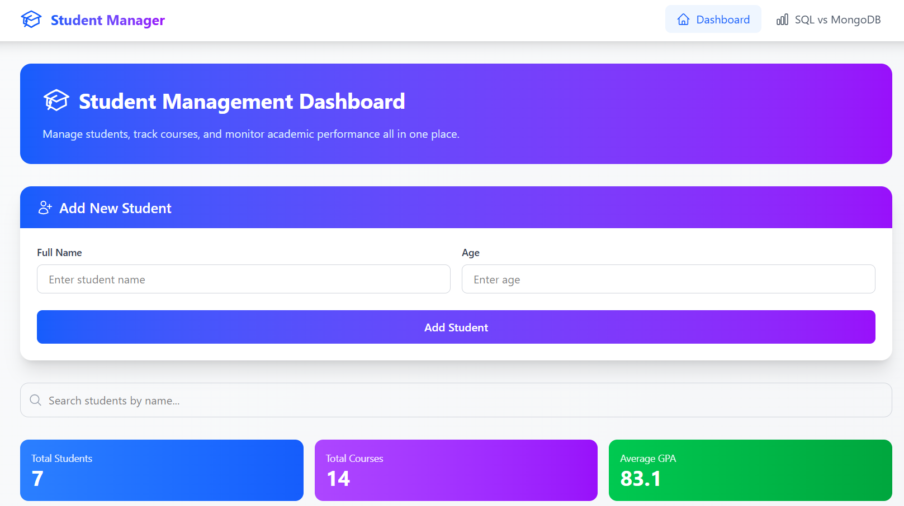
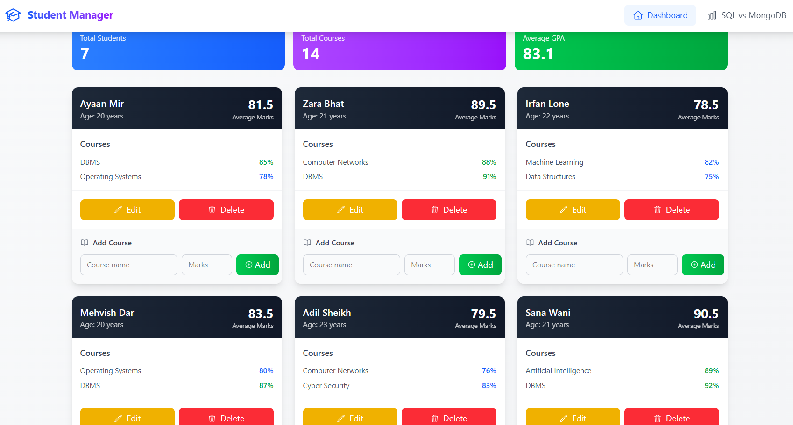
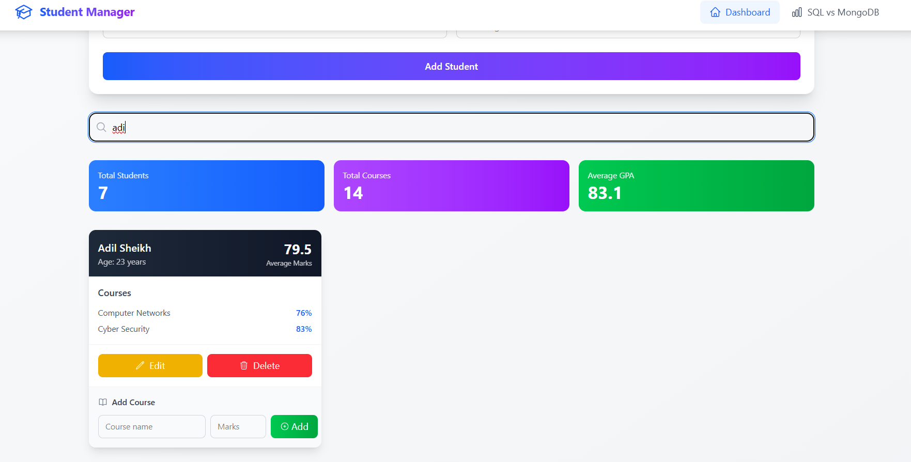

# 🎓 Student Course Manager (MongoDB vs SQL Demonstration)

A full-stack web application built using **React (Vite), Flask, and MongoDB Atlas** to manage students and their enrolled courses.
This project demonstrates full CRUD operations and highlights the key differences between **SQL (Relational)** and **NoSQL (MongoDB)** databases.

---

## 🚀 Features

* ➕ Add new students
* 📚 Add courses to students
* 📖 View all students and their courses
* ✏️ Update student details
* ❌ Delete students
* 🔍 Real-time search functionality
* 📊 SQL vs MongoDB comparison page

---

## 🧠 Key Concept

This project demonstrates how **MongoDB (NoSQL)** differs from **SQL databases**:

| SQL (Relational) | MongoDB (NoSQL) |
| ---------------- | --------------- |
| Fixed schema     | Flexible schema |
| Multiple tables  | Single document |
| Requires JOINs   | No JOIN needed  |
| Structured data  | Embedded data   |

### Example MongoDB Document

```json
{
  "name": "Ayaan Mir",
  "age": 20,
  "courses": [
    { "course_name": "DBMS", "marks": 85 }
  ]
}
```

---

## 🛠️ Tech Stack

### Frontend

* React (Vite)
* Tailwind CSS
* Axios

### Backend

* Python (Flask)
* Flask-CORS
* python-dotenv

### Database

* MongoDB Atlas (Cloud NoSQL Database)

---

## 📁 Project Structure

```
project-root/
│
├── backend/
│   ├── app.py
│   ├── config.py
│   ├── models/
│   └── routes/
│
├── frontend/
│   ├── src/
│   │   ├── components/
│   │   ├── pages/
│   │   └── api.js
│
└── README.md
```

---

## ⚙️ Installation & Setup

### 1️⃣ Clone the Repository

```bash
git clone https://github.com/your-username/student-course-manager.git
cd student-course-manager
```

---

### 2️⃣ Backend Setup

```bash
cd backend
python -m venv venv
venv\Scripts\activate   # Windows

pip install -r requirements.txt
```

Create a `.env` file inside `backend/`:

```
MONGO_URI=your_mongodb_atlas_connection_string
```

⚠️ **Important:** Never commit your `.env` file or actual MongoDB URI to GitHub.

Run backend:

```bash
python app.py
```

---

### 3️⃣ Frontend Setup

```bash
cd frontend
npm install
npm run dev
```

---

## 🌐 API Endpoints

| Method | Endpoint               | Description      |
| ------ | ---------------------- | ---------------- |
| POST   | `/students/add`        | Add student      |
| GET    | `/students/all`        | Get all students |
| POST   | `/students/add-course` | Add course       |
| DELETE | `/students/delete/:id` | Delete student   |
| PUT    | `/students/update/:id` | Update student   |

---

## 🎯 Learning Outcomes

* Understanding SQL vs NoSQL database design
* Working with MongoDB documents and ObjectId
* Building REST APIs using Flask
* Connecting React frontend with backend APIs
* Implementing full CRUD operations

---

## 📸 Screenshots

### 🏠 Home Page


### 📚 Student List


### 🔍 Search Feature


### 📊 SQL vs MongoDB Comparison


---

## 🧠 Author

Zeeshan Zahoor.
Developed as a DBMS mini project.

---

## 🚀 Future Improvements

* 🔐 Authentication (Login/Signup)
* 🌐 Deployment (Render + Vercel)
* ✏️ Edit course feature
* 📊 Data visualization (charts)

---

## ⭐ Acknowledgement

This project was built for academic learning to explore full-stack development and NoSQL database concepts.

---

## 📌 Note

This project is intended for educational purposes and demonstrates the advantages of document-based databases over traditional relational models.

---